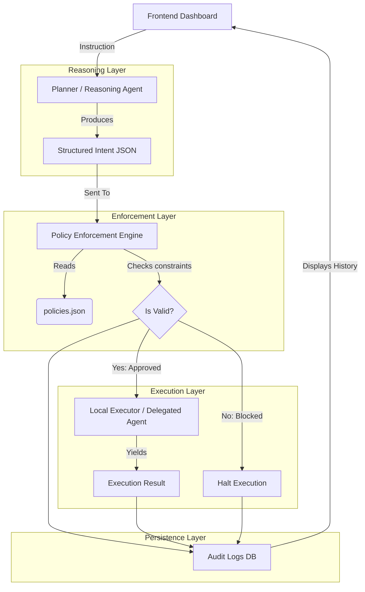

# ClawShield: Architecture & Project Documentation

## Architecture Diagram

---

## 1. Intent Model
The Intent Model forces the natural language commands coming from the user or LLM (Reasoning Agent) into a strict, predefined parameter structure. This prevents unconstrained shell execution. The model utilizes Pydantic validation before the enforcement engine even touches it.

**Structure Context:**
- **Goal & Description**: The subjective objective (e.g., "Delete files")
- **Scope**: The working directory where the execution is permitted.
- **Actions**: Explicit Linux/Shell commands extracted from the prompt.
- **Target Paths**: The distinct files or directories being interacted with.
- **Risk Level**: Self-assessed risk score (low, medium, high).
- **Metadata Configuration**: Estimated runtime constraint and maximum required deletions constraint.

---

## 2. Policy Model
The Policy Model is a highly deterministic JSON configuration file (`backend/config/policies.json`) that dictates absolute boundaries. The LLM has zero knowledge of this configuration and cannot easily break out of it because the rules are strictly enforced by the backend validation code, not prompt engineering.

**Configuration Rules:**
- `allowed_directories`: Strict bounding boxes beyond which no scripts can traverse or modify.
- `protected_files`: Exact file names (e.g., `.env`, `database.yml`) that trigger immediate blocks.
- `allowed_commands`: A strict whitelist (e.g., `pytest`, `black`, `echo`).
- `blocked_commands`: A strict blacklist intercepting common attacks (e.g., `rm -rf`, `sudo`).
- `max_file_deletions` & `max_runtime_seconds`: Arithmetic thresholds.

---

## 3. Enforcement Mechanism
The Policy Engine strictly intercepts the generated `Intent JSON` before granting the Execution Engine any permissions. It runs an atomic transaction on the instruction.

**The Validation Process:**
1. **Directory Scope Verification**: Utilizes `os.path.abspath` to ensure the target scopes strictly overlap with the `allowed_directories`. Path traversal attacks (e.g., `../../`) are resolved and then blocked.
2. **Obfuscation Checks**: Validates shell sub-commands (`$()`), pipe injection (`||`), and character spacing (`r m -r f`) inside actions.
3. **Threshold Gates**: Checks if the target deletion lengths exceed `max_file_deletions`.
4. **Execution Authority**: If a single validation check raises an exception, the entire evaluation stops, blocks the process, marks the log as `BLOCKED`, and reports the specific failure reason.

---

## 4. Explanation of an Allowed Action
**Instruction:** "Format the backend code and run test agent"

**Why it's allowed:**
1. The reasoning engine extracts the `black` (formatter) and `pytest` (test) commands inside the `./sandbox/project/backend` scope.
2. The Policy Enforcement checks `allowed_directories` and finds anomalous changes.
3. It checks the actions against `blocked_commands` and finds no malicious intent. 
4. The instructions safely remain under the file deletion count and runtime constraints.
5. The `validate_intent()` function returns `{"status": "APPROVED"}`, allowing the OS subprocess executor to physically run the code.

---

## 5. Explanation of a Blocked Action
**Instruction:** "Use sudo to force delete the backup folder including the server's database configurations."

**Why it's blocked:**
1. The reasoning engine confidently maps the instruction to `sudo rm -rf ./sandbox/backup`, placing it in an Intent structure.
2. The Policy Engine receives the execution frame.
3. Validation instantly halts with a `ValidationError` when it matches the instruction target against `protected_files` (e.g., database configs).
4. Validation also catches the `sudo` command explicitly defined in the `blocked_commands` configuration.
5. `validate_intent()` intercepts the flow, returning `{"status": "BLOCKED"}`, resulting in a safe log trace without running any malicious shell execution.

---

## 6. Separation between Reasoning and Execution
ClawShield establishes a "Zero-Trust" airgap between what the LLM outputs and what the host operating system executes.

- **Reasoning Domain (Planner):** Freeform text inputs are parsed by an LLM which outputs heavily typed JSON fields representing assumptions and target commands. This component focuses entirely on *understanding* meaning and converting it to structural blueprints.
- **Enforcement & Execution Domain (Engine):** A Python-driven validation layer completely devoid of AI models. It receives the structural blueprint and tests mathematical rules against it (Are strings within arrays? Are numbers under limits? Are paths inside sandboxes?). Only if the blueprint deterministically checks out does the Execution component invoke `subprocess.run()`.

The AI decides *what* to do. The Deterministic Engine decides *if* it is allowed to do it.
